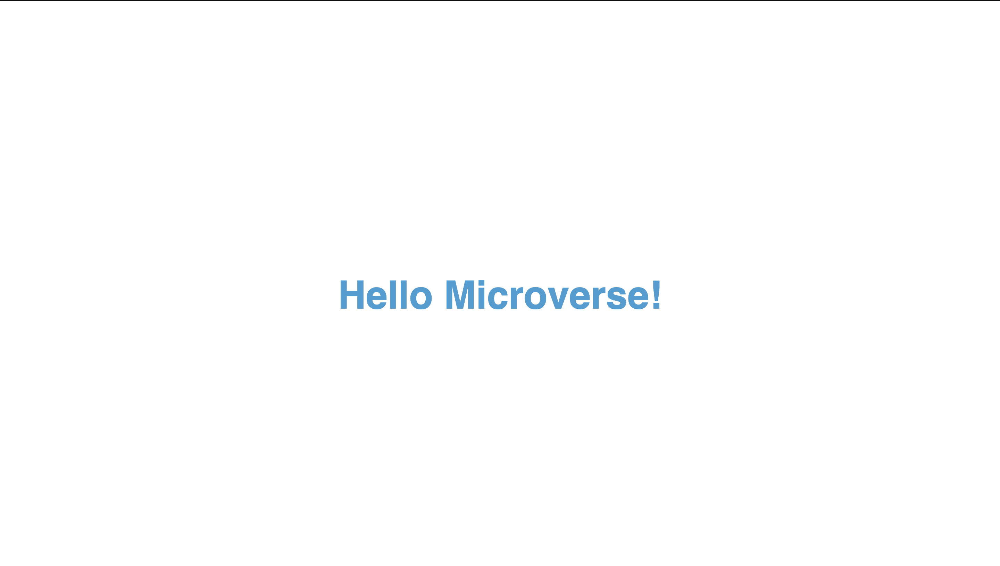

# Hello Microverse

> The objective here is to ace all of the apparatuses and best hones i learned around in past steps. I'll be utilizing them in all Microverse ventures and most likely in your future work as well, so it is vital to know them!

My first project with microverse
## Built With

- HTML & CSS
- Html & Css linters

## Live Demo

[Live Demo Link](https://livedemo.com)

## Getting Started
- clone the repository by running\
    `git clone https://github.com/aimemalaika/Hello-Microverse.git`
- navigate to the folder\
    `cd Hello-Microverse`

## Authors

👤 **Author**

- GitHub: [@githubhandle](https://github.com/aimemalaika)
- Twitter: [@twitterhandle](https://twitter.com/Aime_Malaika)
- LinkedIn: [LinkedIn](https://linkedin.com/in/aimemalaika)

## 🤝 Contributing

Contributions, issues, and feature requests are welcome!

## Show your support

Give a ⭐️ if you like this project!

## Acknowledgments

- Hat tip to anyone whose code was used
- Inspiration
- etc

## 📝 License

This project is [MIT](./MIT.md) licensed.